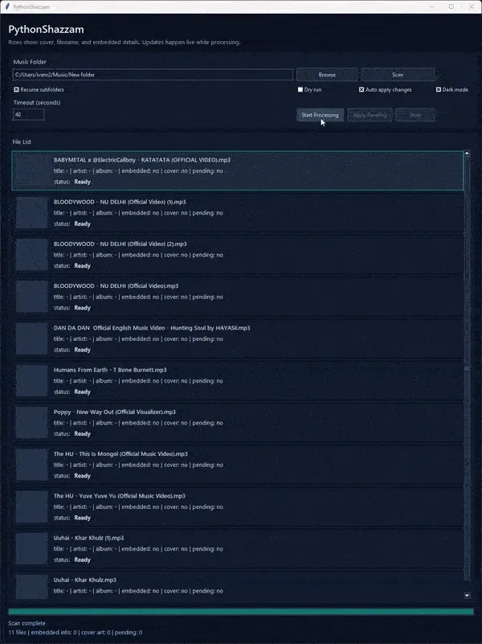

# PythonShazzam

Identify MP3 tracks by audio with Shazam, rename files, and write ID3 tags.



## Install

```bash
python -m pip install -r requirements.txt
```

Recommended Python version: `3.12` or `3.13`.

`shazamio-core` may crash on `3.14` on some systems (exit code `3221225477`).

If you are using Python 3.13+ on Windows, install this compatibility package once:

```bash
python -m pip install audioop-lts
```

## CLI

```bash
python music.py "path/to/music/folder" --recurse --verbose
```

Useful options:
- `--dry-run`: preview without changing files
- `--timeout`: per-file Shazam timeout in seconds

## GUI

```bash
python gui.py
```

On Windows, easiest launch:

```bat
run_gui.bat
```

`run_gui.bat` uses a local Python 3.12 virtual environment (`.venv312`) and will create/install it automatically on first run.

The GUI lets you:
- choose the target music folder
- immediately list MP3 files after folder selection
- view embedded title/artist/album and whether cover art is already embedded
- preview embedded cover art for selected files
- run/stop processing with live per-file status updates
- open `Listen Mode` for live Shazam detection from:
  - `System audio` using Windows output capture
  - `Local listen` using the default microphone
  - `Both`
- watch a real-time waveform while listening
- optionally auto-preview the captured sample before it is sent to Shazam
- see the latest detected track with cover art and external track link
- see a rolling live-results list for recognized tracks
- toggle `Auto apply changes`:
  - ON: writes rename/tags during processing
  - OFF: detects and fills pending info without writing; use `Apply Pending` to commit later
- preview Shazam cover art in pending mode before writing
- right-click a row for `Open File`, `Open Folder`, and `Rescan Item`
- starts in dark mode with a toggle for light mode

### Listen Mode Notes

- `System audio` prefers `Stereo Mix` when available and falls back to loopback capture if needed.
- Automatic preview can be turned off from the modal if you want direct recognition without playback.
- Live recognition uses rolling captured samples and may need several seconds of audio before the first Shazam attempt.

## Build EXE (Windows)

Single-file GUI executable:

```bat
.venv312\Scripts\pyinstaller.exe --noconfirm --clean --onefile --windowed --name PythonShazzamGUI-onefile --collect-all shazamio --collect-all shazamio_core --collect-all mutagen gui.py
```

Output:

```text
dist\PythonShazzamGUI-onefile.exe
```
